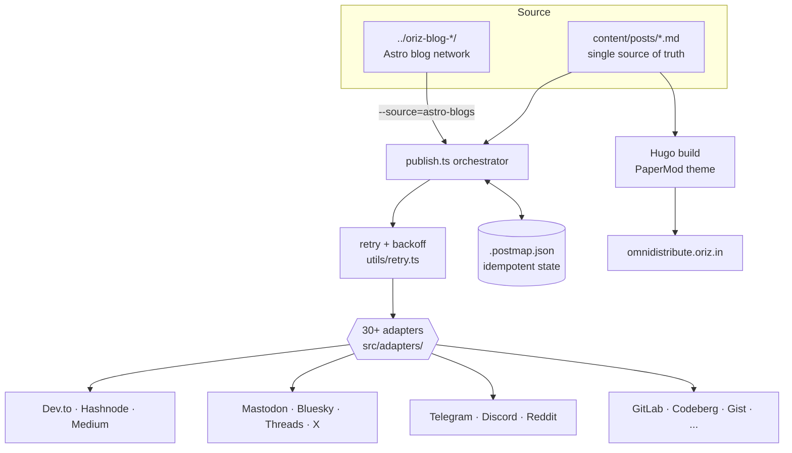

# OmniDistribute

> Write a Markdown article once; publish it to 30+ platforms and generate a fast static blog from the same source.

[](./LICENSE)
[](https://github.com/chirag127/OmniDistribute/stargazers)
[](https://github.com/chirag127/OmniDistribute/commits)
[](https://github.com/chirag127/OmniDistribute/actions)
[](https://www.typescriptlang.org/)


## What it is / why it exists

Cross-posting a single article to Dev.to, Hashnode, Medium, Mastodon, Bluesky, Telegram, and dozens more is tedious and error-prone — you lose SEO credit, duplicate posts on re-runs, and give up when one API times out. OmniDistribute is a resilient, idempotent, multi-channel distribution engine: keep one Markdown source of truth, fan it out to 30+ platform adapters, set canonical URLs automatically, and never double-post. The same content also builds a fast static Hugo blog.

## Links

- **Live site:** https://omnidistribute.oriz.in
- **Landing page:** https://omnidistribute.oriz.in
- **Repository:** https://github.com/chirag127/OmniDistribute

> ⭐ If this is useful, please star the repo — it helps others find it.

## Architecture / data flow



## Features

- **Single-source Markdown** in `content/posts/` is the one source of truth.
- **Fan-out publish** to 30+ platform adapters (`src/adapters/`): Dev.to, Hashnode, Medium, Blogger, WordPress, Notion, Reddit, Bluesky, Mastodon, Threads, Twitter/X, LinkedIn, Telegram, Discord, GitLab, Bitbucket, Codeberg, Gist, Telegraph, Tumblr, VK, Weibo, Plurk, Pixnet, LiveJournal, Neocities, Wix, Strapi, EdgeOne, Pastebin, Showwcase, and more.
- **Idempotent** — a per-post state map (`.postmap.json`) prevents duplicate posts across runs.
- **Resilient** — retry with backoff (`src/utils/retry.ts`) on network/API failure; one failing platform doesn't stop the rest.
- **Credential-gated** — only platforms whose credentials are present in `.env` are targeted; the rest are skipped.
- **Canonical-URL aware** — cross-posts point back to the origin so the source keeps SEO credit.
- **Blog-network mode** — ingest the oriz.in Astro blog network instead of `content/posts/`.
- **Static blog** built with Hugo (PaperMod theme).

## Tech stack

- **Language:** TypeScript 5.x on the `tsx` runtime (Node ≥ 22)
- **Static site:** Hugo (extended ≥ 0.138), PaperMod theme
- **Key deps:** axios, googleapis, `@notionhq/client`, `@tryghost/admin-api`, `@hubspot/api-client`, gray-matter, marked, oauth-1.0a, simple-oauth2, winston, dotenv
- **Tooling:** Biome (lint/format), pnpm
- **Automation:** GitHub Actions (publish-sync, hugo-deploy, verify-links, issue-to-post, MegaLinter)

## Repo structure

```
content/posts/        Markdown source of truth
src/
  publish.ts          orchestrator — reads source, fans out to adapters
  adapters/           one file per platform (devto.ts, mastodon.ts, ...)
  sources/            input sources (default posts, astro-blogs.ts)
  utils/              retry/backoff + shared helpers
  types.ts            adapter interface + shared types
  seed-content.ts     seed sample content
  verify-env.ts       report which platform credentials are set
  verify-links.ts     validate published links
layouts/ · assets/ · static/ · themes/   Hugo site
hugo.yaml             Hugo config (baseURL, PaperMod, menus)
.postmap.json         per-post idempotency state
.env.example          documents every platform env var
.github/workflows/    publish-sync · hugo-deploy · verify-links · issue-to-post · ci · megalinter
```

## Screenshots

_Live at [omnidistribute.oriz.in](https://omnidistribute.oriz.in). Screenshot placeholder — add `docs/screenshot.png` and reference it here._

## Quick start

```bash
git clone https://github.com/chirag127/OmniDistribute.git
cd OmniDistribute
pnpm install
cp .env.example .env   # fill in the platform API keys you want to target
```

## Usage

```bash
pnpm verify-env      # check which platform credentials are set
pnpm seed            # seed sample content
pnpm start           # publish content/posts/ to all configured platforms
pnpm deploy          # build the static site (hugo --minify)
pnpm verify-links    # validate published links
pnpm lint            # biome check src
pnpm format          # biome format --write src
```

Only platforms whose credentials are present in `.env` are targeted; the rest are skipped. Re-running is safe — already-published posts are recorded in `.postmap.json` and are not re-posted.

### Blog-network mode

Ingest the oriz.in blog network (sibling Astro blogs at `../oriz-blog-<niche>/`) instead of `content/posts/`:

```bash
pnpm start -- --source=astro-blogs      # or: SOURCE=astro-blogs pnpm start
```

- **Scan** — reads `../oriz-blog-*/src/content/blog/*.{md,mdx}` (root overridable via `BLOG_NETWORK_ROOT`). Missing/empty/draft repos are skipped silently.
- **Canonical** — every cross-post sets `canonical_url` back to `https://<niche>-blog.oriz.in/blog/<slug>/`, so the origin keeps SEO credit.
- **Per-niche routing** — configurable via `BLOG_ROUTE_<NICHE>=devto,medium,...`; map lives in `src/sources/astro-blogs.ts`.
- **Idempotent** — state key is `<niche>/<slug>` so identical slugs across blogs never collide in `.postmap.json`.

## Configuration

Every platform is configured via environment variables documented in `.env.example`. Names only — never commit real values.

| Env var | Purpose |
|---|---|
| `DEVTO_API_KEY` | Dev.to publishing |
| `HASHNODE_TOKEN` | Hashnode publishing |
| `MEDIUM_TOKEN` | Medium publishing |
| `NOTION_TOKEN` | Notion publishing |
| `GHOST_ADMIN_API_KEY` | Ghost publishing |
| `BLUESKY_HANDLE` / `BLUESKY_APP_PASSWORD` | Bluesky auth |
| `MASTODON_ACCESS_TOKEN` | Mastodon publishing |
| `TELEGRAM_BOT_TOKEN` / `TELEGRAM_CHAT_ID` | Telegram publishing |
| `REDDIT_USERNAME` / `REDDIT_PASSWORD` / `REDDIT_CLIENT_ID` / `REDDIT_CLIENT_SECRET` | Reddit auth |
| `GITLAB_TOKEN` / `BITBUCKET_APP_PASSWORD` / `CODEBERG_TOKEN` | Git host snippets |
| `BLOG_NETWORK_ROOT` | Override Astro blog-network scan root |
| `BLOG_ROUTE_<NICHE>` | Per-niche platform routing override |
| `SOURCE` | Select input source (`posts` default, `astro-blogs`) |

> This is a subset — see `.env.example` for the full, authoritative list of platform credentials.

## Adding a platform

Add `src/adapters/<name>.ts` implementing the adapter interface in `src/types.ts`, wire it into `src/publish.ts`, and document its env var in `.env.example`.

## Part of the oriz family

One of ~80 sites in the [oriz](https://blog.oriz.in) family. OmniDistribute is the engine that fans the oriz blog network out to the wider web. See the blog at [blog.oriz.in](https://blog.oriz.in).

## Cost

Hosting runs **$0 on the Cloudflare free tier**.

## Contributing

Issues and PRs welcome. New adapters are the most valuable contribution — follow the "Adding a platform" pattern and keep them idempotent and retry-safe.

## Status

Actively used in production for the oriz blog network. Adapter coverage is broad and growing. Conventional commits are the changelog.

## License

[MIT](./LICENSE) © Chirag Singhal

## Author

Chirag Singhal — chirag@oriz.in
